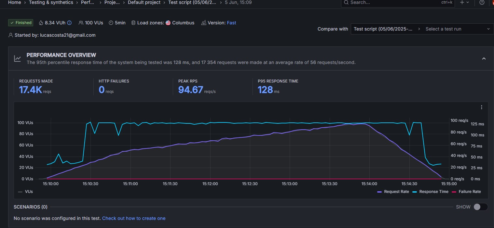
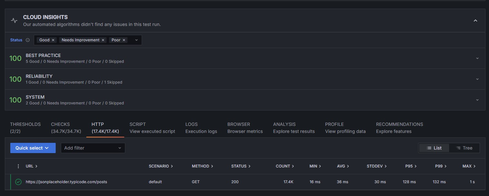

# 🧪 Avaliação Prática - Teste de Carga com K6

Este repositório contém o resultado do desafio prático de testes automatizados de carga utilizando a ferramenta [K6](https://k6.io/), com execução via Grafana Cloud.

---

## 🎯 Objetivo

Avaliar o comportamento de uma API pública sob carga de 100 usuários simultâneos durante 5 minutos, coletando métricas de desempenho e estabilidade.

---

## 🛠️ Ferramentas Utilizadas

- [K6](https://k6.io/) (executado via Grafana Cloud)
- API pública: `https://jsonplaceholder.typicode.com/posts`
- Script de teste em JavaScript
- Dashboard da K6 Cloud (Grafana)
- Git + GitHub

---

## 📜 Script Utilizado

O script utilizado para simular os usuários está no arquivo:

📄 [`teste-carga.js`](./teste-carga.js)

---

## 📊 Evidências (Gráficos da execução)

Os gráficos abaixo foram capturados diretamente do dashboard da K6 após a execução do teste:

### 🔸 Performance overview

### 🔸 ## Visão Geral do Teste

---

## 📄 Relatório Técnico

O relatório completo da execução está disponível no arquivo:

📎 [`Relatorio_Teste_Carga_K6.docx`](./Relatorio_Teste_Carga_K6.docx)

---

## ✅ Conclusão

A API pública demonstrou excelente estabilidade sob carga de 100 usuários simultâneos. O tempo de resposta p95 permaneceu em 38ms e não foram registradas falhas HTTP.

> Observação: o teste foi executado com 100 VUs devido à limitação do plano gratuito da K6 Cloud. O mesmo script pode ser escalado para 500 usuários em ambiente local.

---
